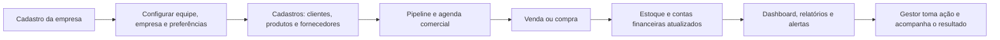

# SobControle — documentação completa do sistema

> **Versão do documento:** 1.0
> **Produto:** SobControle
> **Assistente inteligente:** Gestly
> **Público:** gestores, equipes comerciais, operação, financeiro, implantação e desenvolvimento.

## 1. Visão do produto

O SobControle é uma plataforma de gestão para pequenas e médias empresas. Ela reúne o relacionamento com clientes, vendas, pipeline comercial, agenda, estoque, compras, financeiro, documentos, relatórios e notificações em um único ambiente.

O objetivo é substituir controles dispersos — planilhas, mensagens, anotações e sistemas isolados — por uma fonte confiável de informação. Cada empresa possui seu próprio ambiente, seus usuários e seus dados isolados.

O Gestly é a camada de inteligência do produto: hoje ele apoia a priorização por regras e sugestões contextuais nas notificações e na Central de Inteligência. Os recursos de IA conversacional, importação inteligente e conexão bancária estão previstos para evolução; não devem ser apresentados como disponíveis enquanto não forem implementados.

## 2. Problemas que o sistema resolve

| Problema comum na PME | Como o SobControle ajuda |
| --- | --- |
| Clientes, vendas e negociações espalhados | Centraliza cadastro, histórico comercial e pipeline. |
| Oportunidades esquecidas ou sem retorno | Mostra negócios parados, propostas próximas do vencimento e tarefas pendentes. |
| Estoque descoberto tarde | Mantém quantidade atual e níveis mínimo/máximo, com alertas de estoque baixo. |
| Falta de visão de entradas e saídas | Organiza contas a receber, contas a pagar, pagamentos e fluxo de caixa. |
| Decisões tomadas por sensação | Apresenta indicadores e relatórios por período, incluindo DRE. |
| Equipe sem organização de agenda | Registra reuniões, tarefas, ligações, visitas e lembretes vinculados ao cliente ou negócio. |
| Arquivos sem rastreabilidade | Armazena documentos por categoria e relaciona-os a vendas, compras, clientes ou fornecedores. |

## 3. Para quem é

- **Administrador:** configura a empresa, equipe, assinatura, módulos e possui acesso completo, inclusive ao painel administrativo.
- **Gerente:** opera a gestão comercial e financeira, relatórios, compras, empresa e configurações; não acessa o painel administrativo.
- **Colaborador:** atua nos módulos operacionais autorizados, como vendas, clientes, estoque, fornecedores, documentos, agenda e pipeline.

## 4. Como o acesso e a segurança funcionam

1. A pessoa cria uma conta ou entra com e-mail e senha.
2. No cadastro, o sistema cria a empresa, o perfil do usuário e uma assinatura de teste em uma única operação.
3. A assinatura ativa ou em teste libera o uso; uma assinatura inativa encaminha o usuário para a tela correspondente.
4. As permissões da função do usuário definem quais telas podem ser abertas.
5. O banco de dados aplica isolamento por empresa (RLS): mesmo que alguém tente acessar dados por fora da interface, só enxerga registros da própria empresa.

Isso cria duas barreiras: a interface não oferece funções indevidas e o banco não entrega dados de outra empresa.

## 5. Fluxo operacional principal

## 6. Funcionalidades disponíveis

### 6.1 Dashboard executivo

É a página inicial da operação. Consolida receita do mês, volume de vendas, itens com estoque baixo, vendas semanais, atividade recente, produtos de maior saída, saúde financeira e valores a receber/a pagar/vencidos. Também oferece atalhos para criar venda, produto ou cliente.

**Benefício:** o gestor enxerga a situação da empresa antes de entrar em cada módulo e pode agir sobre exceções rapidamente.

### 6.2 Clientes

Permite cadastrar, editar, consultar, pesquisar, ativar e inativar clientes pessoa física ou jurídica. O cadastro pode guardar CPF/CNPJ, contato e endereço. A tela de detalhe concentra as informações do relacionamento.

**Uso recomendado:** cadastrar o cliente antes de abrir uma oportunidade, compromisso ou venda, preservando um histórico único.

### 6.3 Vendas

Permite listar, filtrar, registrar, editar e consultar vendas. Uma venda possui cliente, itens/produtos, desconto, acréscimo, valor final, observações, método de pagamento e situação de pagamento. Os métodos incluem dinheiro, cartão, Pix, boleto, transferência e outros.

As vendas podem alimentar contas a receber e os indicadores comerciais/financeiros.

**Benefício:** reduz retrabalho entre a operação comercial e o controle financeiro, além de permitir medir receita por período e produto.

### 6.4 Pipeline comercial (Kanban)

Organiza oportunidades em etapas configuráveis para cada empresa. Os cartões de negócio podem ser movimentados por arrastar e soltar, possuem cliente, responsável, valor, previsão de fechamento e observações. O histórico registra as mudanças de etapa. O negócio pode ser marcado como ganho ou perdido, incluindo motivo de perda.

**Benefício:** torna o funil de vendas visível, identifica gargalos e evita que oportunidades fiquem sem acompanhamento.

### 6.5 Agenda

Reúne reuniões, tarefas, ligações, visitas e lembretes em visões mensal, semanal e diária. Um compromisso pode ser relacionado a cliente, negócio e responsável. Há movimentação na visão mensal, indicador de atraso e conclusão de tarefas.

**Benefício:** conecta a rotina diária ao processo comercial e melhora a previsibilidade de follow-ups.

### 6.6 Estoque e produtos

Permite gerenciar produtos e categorias, com SKU, código de barras, unidade, custos, preços, quantidade atual, estoque mínimo/máximo e situação ativa/inativa. Inclui ajuste manual de estoque e importação por CSV.

**Benefício:** reduz ruptura, excesso de mercadoria e erros de precificação; o acompanhamento de custo e preço apoia a margem.

### 6.7 Fornecedores e compras

O cadastro de fornecedores concentra CNPJ, contato e situação. Compras são registradas com fornecedor, itens, valores, descontos, acréscimos, método e situação de pagamento, e possuem tela de detalhe. O acesso a compras é exclusivo de administradores e gerentes.

**Benefício:** liga abastecimento, estoque e contas a pagar, dando rastreabilidade ao custo da operação.

### 6.8 Financeiro

O módulo financeiro organiza:

- contas a receber, inclusive originadas de vendas;
- contas a pagar, inclusive relacionadas a compras;
- lançamentos manuais;
- alteração de situação (paga, pendente, atrasada ou cancelada) e método de pagamento;
- fluxo de caixa por período;
- cadastro de categorias de receita e despesa.

**Limitação atual importante:** as categorias financeiras são um cadastro independente; nesta versão elas ainda não estão vinculadas diretamente aos lançamentos por uma chave de categoria. O sistema não deve apresentar uma classificação financeira automática por categoria como se já estivesse pronta.

**Benefício:** oferece posição de caixa e pendências financeiras sem depender de planilha paralela.

### 6.9 Documentos

Permite enviar, visualizar, filtrar, arquivar e excluir documentos. Os arquivos podem ser classificados como nota fiscal, contrato, boleto, recibo, documento da empresa, cliente, fornecedor ou outros; também podem ser relacionados a uma venda, compra, cliente ou fornecedor.

**Benefício:** mantém evidências e documentos operacionais junto do contexto ao qual pertencem.

### 6.10 Relatórios e Central de Inteligência

O menu Relatórios possui rotas próprias para:

1. Visão Geral;
2. Central de Inteligência;
3. Vendas e Pipeline;
4. Clientes;
5. Financeiro, incluindo DRE;
6. Estoque e Compras;
7. Relatórios Personalizados.

Os relatórios trabalham com período, gráficos, indicadores e exportação CSV onde aplicável. A Central de Inteligência apresenta um catálogo de módulos analíticos e seus estados: disponível, contratado, bloqueado ou em breve. Antes de carregar dados, o sistema verifica papel, plano, add-on e situação do módulo.

**Estado atual:** relatórios personalizados estão marcados como “em breve”. Alguns cartões de inteligência encaminham para análises já existentes, mas análises profundas específicas — como previsão de caixa, churn score ou giro avançado — ainda são evoluções planejadas.

### 6.11 Notificações inteligentes

A central de notificações apresenta alertas em tempo real, com badge de não lidas e ações de tratamento. Ela cobre, entre outros, compromisso próximo ou atrasado, negócio parado, proposta vencendo, venda sem follow-up, cliente em risco, contas vencidas e estoque baixo.

Cada alerta pode trazer resumo, prioridade, justificativa, ação sugerida e texto sugerido pelo Gestly. O usuário pode abrir o item relacionado, criar tarefa, agendar reunião, alterar responsável, adiar, resolver ou arquivar. A empresa define política geral; cada pessoa define preferências de canal, categorias, prioridade mínima, horário silencioso e frequência de resumo.

- **In-app:** disponível dentro do sistema.
- **Push, e-mail e SMS:** dependem de consentimento e de configuração de provedores externos.
- **Fila de entrega:** registra tentativas, falhas, retentativas e histórico.

**Esclarecimento sobre IA:** nesta versão, as recomendações do Gestly usam regras e modelos de texto determinísticos. Não há chatbot generativo conectado aos dados operacionais ainda.

### 6.12 Configurações, empresa, perfil e administração

- **Minha Empresa:** dados corporativos e preferências principais.
- **Configurações:** geral, aparência, dados, integrações, notificações, segurança, equipe e assinatura.
- **Perfil:** dados do usuário autenticado.
- **Administração:** tela reservada ao administrador.
- **Tema claro/escuro:** preferência persistida por usuário no navegador.

## 7. Dados principais administrados

| Domínio | Registros principais |
| --- | --- |
| Organização | empresas, assinatura, configurações e perfis de usuário |
| Comercial | clientes, vendas, itens da venda, etapas e negócios do pipeline |
| Operação | produtos, categorias, fornecedores, compras e itens da compra |
| Financeiro | contas a receber, contas a pagar e categorias financeiras |
| Relacionamento | compromissos, documentos e notificações |
| Inteligência | catálogo de módulos analíticos, contratação e histórico de alterações |

## 8. Integrações e arquitetura

O sistema é uma aplicação web responsiva construída com React, TypeScript e Vite. A interface usa Tailwind CSS; formulários usam validação; gráficos usam Recharts; o estado de dados é controlado por React Query.

O Supabase fornece autenticação, banco PostgreSQL, armazenamento de arquivos, atualizações em tempo real e políticas RLS. Uma função de backend processa a fila de notificações e possui adaptadores para push, e-mail e SMS. Esses canais só enviam mensagens quando as credenciais do provedor forem configuradas em segredo no ambiente de backend.

## 9. Assinaturas e módulos comerciais

O produto trabalha com teste de 14 dias e planos Pro/Enterprise. A assinatura pode estar ativa, em teste, inativa, cancelada ou vencida. O catálogo de BI permite controlar a disponibilidade de módulos por plano e por add-on, mas **não há cobrança nem contratação automática no sistema**: os botões de módulos bloqueados exibem orientação e levam à área de assinatura.

## 10. Recursos planejados

| Prioridade | Recurso | Resultado esperado |
| --- | --- | --- |
| Alta | Cobranças recorrentes | Gerir mensalidades e recorrências dos próprios clientes. |
| Alta | WhatsApp Business | Comunicação real de ida e volta com clientes. |
| Média | Chat Gestly | Consultar dados e receber apoio conversacional dentro da plataforma. |
| Média | Importação inteligente | Ler CSV/XLSX, mapear campos e impedir importações inválidas. |
| Média | Open Finance | Conectar contas bancárias, trazer extratos e categorizar transações. |
| Média | Analytics aprofundado | Funil, churn, previsão de caixa, giro e outras análises específicas. |
| Média | Marketing e automação | Campanhas e follow-ups baseados em comportamento. |
| Longo prazo | API pública e webhooks | Integrar sistemas externos. |
| Longo prazo | Vídeos com agentes de IA | Produzir materiais comerciais personalizados. |

## 11. Lacunas e recomendações para evolução

As sugestões abaixo não representam funcionalidades já entregues; são itens recomendados para tornar o produto mais pronto para operação comercial em escala.

1. **Cobrança e faturamento:** integrar um provedor de pagamentos, emissão fiscal quando aplicável, conciliação e réguas de cobrança.
2. **LGPD e governança:** política de privacidade, termos, base legal, exportação/anonimização de dados, retenção, registro de consentimento e canal para solicitações do titular.
3. **Auditoria operacional:** registrar quem criou, alterou ou excluiu registros sensíveis, além do histórico já existente no pipeline e em módulos analíticos.
4. **Backup e continuidade:** definir rotina de backup, teste de restauração, objetivos de recuperação e monitoramento de disponibilidade.
5. **Gestão de usuários:** convite por e-mail, desativação, redefinição de função e visão de sessões/dispositivos.
6. **Qualidade de dados:** validação de CPF/CNPJ, deduplicação de clientes, trilha de importação e relatório de registros inconsistentes.
7. **Acessibilidade e experiência móvel:** manter testes de teclado, contraste, leitores de tela e fluxos de venda/agenda em dispositivos móveis reais.
8. **Medição de resultado:** definir indicadores do próprio produto: adoção por módulo, tempo até primeira venda, taxa de follow-up, inadimplência e conversão do pipeline.
9. **Observabilidade técnica:** rastreamento de erros, métricas de desempenho, alertas de falha de integrações e monitoramento da fila de notificações.
10. **Testes e qualidade:** corrigir o débito de lint documentado no projeto, ampliar testes de integração/E2E e validar as políticas RLS em ambiente de homologação.

## 12. Indicadores empresariais que a plataforma pode apoiar

- Receita, quantidade de vendas e ticket médio;
- conversão por etapa do pipeline e motivos de perda;
- oportunidades sem contato e compromissos atrasados;
- valores a receber, a pagar e vencidos;
- saldo e fluxo de caixa realizado;
- produtos de maior saída e itens abaixo do estoque mínimo;
- compras por fornecedor e evolução de custos;
- produtividade comercial por responsável;
- tempo de resposta a alertas e pendências.

## 13. Limites e premissas importantes

- A plataforma é multiempresa: os dados nunca devem ser compartilhados entre empresas.
- A interface não substitui decisões contábeis, fiscais ou jurídicas; relatórios e DRE devem ser validados pelo responsável competente antes de uso oficial.
- Push, e-mail e SMS exigem consentimento e contratação/configuração de provedores.
- A segurança depende também de boas práticas da empresa: senhas fortes, revisão periódica de perfis e revogação de acesso de ex-colaboradores.
- Recursos indicados como planejados ou “em breve” não devem ser vendidos como disponíveis.

## 14. Guia rápido de implantação para uma empresa

1. Criar a empresa e validar os dados cadastrais.
2. Configurar equipe, funções, fuso horário, aparência e política de notificações.
3. Importar ou cadastrar categorias, produtos, fornecedores e clientes.
4. Definir etapas do pipeline e responsáveis comerciais.
5. Registrar oportunidades, agenda e primeiras vendas/compras.
6. Conferir estoque, contas a receber/a pagar e fluxo de caixa.
7. Ajustar alertas e canais de notificação conforme consentimento.
8. Acompanhar dashboard e relatórios semanalmente; revisar pendências e métricas em reunião de gestão.

## 15. Suporte e evolução deste documento

Este documento descreve o estado atual do repositório e diferencia explicitamente o que está disponível, limitado ou planejado. Ele deve ser atualizado a cada novo módulo, integração, mudança de permissão, alteração de fluxo ou decisão comercial relevante.
